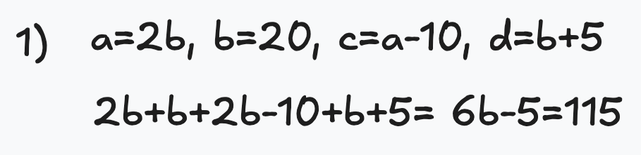

### Problema 1

En una biblioteca, hay una colección de libros distribuidos en cuatro estantes. El
primer estante tiene el doble de libros que el segundo, el tercer estante tiene 10 libros
menos que el primero, y el cuarto estante tiene 5 libros más que el segundo. Si el
segundo estante tiene 20 libros, ¿cuántos libros hay en total en la biblioteca?

- A. 100 libros
- B. 105 libros
- C. 110 libros
- D. <u>115 libros</u>

### Problema 2

En una pista de atletismo, cuatro corredores (J, K, L y M) compiten en una carrera. J
termina antes que K, L termina después de M, y K termina antes que M. ¿Cuál es el
orden de llegada?

- A. <u>J, K, M, L</u>
- B. M, K, J, L
- C. J, K, L, M
- D. L, M, K, J

### Problema 3

Tienes dos relojes de arena. El primero mide 7 minutos y el segundo mide 4 minutos. Si
comienzas ambos relojes al mismo tiempo, ¿cuántos minutos pasarán hasta que
ambos relojes marquen juntos los 0 minutos nuevamente?

- A. 14 minutos
- B. 16 minutos
- C. 18 minutos
- D. <u>28 minutos</u>

### Problema 4

Cuatro amigos (Pedro, Juan, Ana y Sofía) tienen diferentes alturas. Pedro es más alto
que Juan pero más bajo que Ana. Juan es más bajo que Sofía quien a su vez es más alta
que Ana. ¿Quién es el más alto de los cuatro?

- A. Pedro
- B. Juan
- C. Ana
- D. <u>Sofía</u>

### Problema 5

En un mercado, hay cinco puestos en una fila: frutas, verduras, carne, pan y pescado.
Sabes que el puesto de frutas está al lado del puesto de verduras, el puesto de carne
está al lado del puesto de pan, y el puesto de pescado está entre el puesto de frutas y
el puesto de carne. ¿Cuál es el orden de los puestos en la fila?

- A. <u>Frutas, Verduras, Pescado, Carne, Pan</u>
- B. Frutas, Pescado, Pan, Carne,Verduras
- C. Pescado, Frutas, Verduras, Carne, Pan
- D. Frutas, Pescado, Verduras, Carne, Pan
